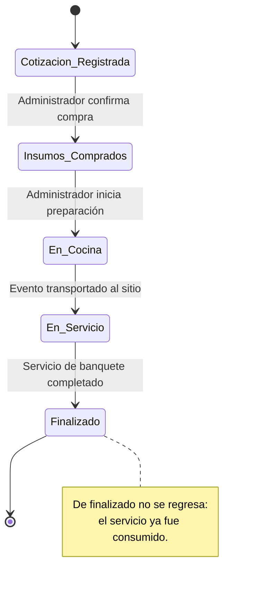

# Hito 1 · Ficha del negocio

**Pareja:**
Camba Molina Zharick Judith
Macias macias Lida Maria
Morales Briones Kristin Ariana
**Paralelo:** Aplicaciones Web 4 B
**Negocio en una línea:** Catálogo de menús para eventos, cálculo automatizado de insumos y control logístico para organizadores de eventos en Manabí.

## 1. Negocio de referencia

**Enlace:** https://www.starterstory.com/catering-business-success-story (Caso de referencia de optimización de menús y logística en Starter Story).

Empresa internacional de catering y organización de eventos corporativos y sociales a gran escala especializada en la gestión de menús personalizados. El negocio vende servicios de banquetes, paquetes de platos fuertes, entradas y bocaditos personalizados orientados a clientes organizadores de bodas, quince años y eventos corporativos. El modelo de cobro se realiza mediante reservas y anticipos de paquetes de servicios en plataforma. En cuanto a sus cifras financieras, el fundador declara ingresos consolidados de $55,000 USD mensuales (cifras declaradas por el fundador, no auditadas).

## 2. Caso de contraste

**Fuente:** Análisis de empresas locales tradicionales de catering que operan de forma manual.

Un caso comparable que se estancó en el mercado local son las empresas tradicionales de catering que gestionan sus pedidos mediante libretas físicas y cálculos de insumos "al ojo". La hipótesis de su estancamiento no radica en una anécdota, sino en una diferencia de fondo en su estructura de costos y modelo operativo: la falta de un cálculo automatizado de insumos según el número exacto de invitados y la nula trazabilidad en la cadena de temperatura de los alimentos provocan mermas elevadas, retrasos críticos en cocina y una alta tasa de cancelación de contratos por desorganización logística.

## 3. Adaptación al Ecuador

1. **Pasarelas de pago y restricciones bancarias:** En Ecuador, los emprendimientos medianos de catering no implementan transferencias complejas o automatizadas directas con pasarelas de pago avanzadas desde el inicio debido a costos operativos; el modelo se adapta mediante el registro de reservas con abonos iniciales manuales validados por el administrador.
2. **Logística y cadena de frío zonal en Manabí:** Las entregas, transporte y montaje de banquetes entre cantones como Manta, Portoviejo y Montecristi dependen críticamente de rutas zonales y del control estricto de la cadena de temperatura para evitar la descomposición de alimentos perecibles.
3. **Informalidad y contratación del personal operativo:** El sector maneja alta informalidad en la contratación temporal de meseros y chefs; la plataforma estandariza la disponibilidad y asignación de personal calificado por evento para evitar incumplimientos laborales.

**Qué cambió en el modelo por estas restricciones:** Se eliminaron los flujos de pasarelas de pago complejas y facturación automática por transferencias, enfocándose exclusivamente en la gestión del catálogo, registro de cotizaciones, cálculo logístico de insumos y asignación de personal.

## 4. Modelo de datos

### Entidad: Cliente

| Atributo | Tipo | Obligatorio | Ejemplo |
|----------|------|-------------|---------|
| id | número entero | sí | 1 |
| nombre | texto | sí | María Zambrano |
| correo | texto | sí | mzambrano@gmail.com |
| telefono | texto | sí | 0998877665 |

### Entidad: PlatoMenu

| Atributo | Tipo | Obligatorio | Ejemplo |
|----------|------|-------------|---------|
| id | número entero | sí | 101 |
| nombre | texto | sí | Seco de Pollo Manabita |
| categoria | uno de: (entrada, plato_fuerte, bocadito) | sí | plato_fuerte |
| precio_por_persona | número decimal | sí | 12.50 |
| stock_insumos | número entero | sí | 500 |

### Entidad: EventoPedido

| Atributo | Tipo | Obligatorio | Ejemplo |
|----------|------|-------------|---------|
| id | número entero | sí | 1001 |
| fecha_evento | fecha | sí | 2026-12-15 |
| tipo_evento | uno de: (boda, quince_anos, corporativo) | sí | boda |
| numero_invitados | número entero | sí | 150 |
| lugar_entrega | texto | sí | Quinta San Alejo, Portoviejo |
| estado | texto | sí | Cotización Registrada |
| total | número decimal | sí | 1875.00 |

### Relaciones

| Entidades | Cardinalidad | Frase |
|-----------|--------------|-------|
| Cliente y EventoPedido | 1:N | Un cliente registra uno o varios eventos pedidos. |
| EventoPedido y PlatoMenu | N:M | Un evento pedido incluye varios platos del menú y un plato está en varios eventos. |

### Diagrama del modelo completo

```mermaid
erDiagram
    CLIENTE ||--o{ EVENTO_PEDIDO : "registra"
    EVENTO_PEDIDO }|--|{ PLATO_MENU : "incluye"
    CLIENTE {
        int id
        string nombre
        string correo
        string telefono
    }
    EVENTO_PEDIDO {
        int id
        date fecha_evento
        string tipo_evento
        int numero_invitados
        string lugar_entrega
        string estado
        decimal total
    }
    PLATO_MENU {
        int id
        string nombre
        string categoria
        decimal precio_por_persona
        int stock_insumos
    }


### Diagrama del modelo completo

```mermaid
erDiagram
    CLIENTE ||--o{ PEDIDO : "realiza"
    PEDIDO }|--o{ PRODUCTO : "incluye"
    CLIENTE {
        string id_cliente
        string nombre
        string correo
        string telefono
    }
    PEDIDO {
        string id_pedido
        date fecha
        string tipo_entrega
        string direccion_o_punto
        string estado
        decimal total
    }
    PRODUCTO {
 stoc
```
## 5. Máquina de estados

## 5. Máquina de estados

**Entidad con estados:** EventoPedido

| Estado | Qué significa |
|---------------------------------|-------------------------------------------------------------------------------------------------|
| Cotización Registrada (inicial) | Estado inicial cuando el cliente selecciona el menú y solicita el presupuesto del banquete. |
| Insumos Comprados | El administrador verifica el stock y adquiere los insumos necesarios para el número de invitados. |
| En Cocina | Se inicia la preparación y procesamiento culinario de los platos bajo control de temperatura. |
| En Servicio (Evento) | El banquete ha sido transportado y se encuentra en ejecución en el lugar del evento. |
| Finalizado | El evento concluyó con éxito y el servicio se dio por terminado. |

| De | A | Quién la hace | Condición |
|-----------------------|-----------------------|---------------|---------------------------------------------------|
| Cotización Registrada | Insumos Comprados | Administrador | Confirmación de disponibilidad de ingredientes |
| Insumos Comprados | En Cocina | Administrador | Inicio de preparación en cocina |
| En Cocina | En Servicio (Evento) | Administrador | Salida del equipo logístico al lugar |
| En Servicio (Evento) | Finalizado | Administrador | Cierre exitoso del banquete |

**Transición prohibida y por qué:** No se puede pasar directamente de Cotización Registrada a En Cocina sin pasar por Insumos Comprados, ni tampoco es posible regresar un evento de Finalizado a estados anteriores, ya que los alimentos ya fueron preparados, servidos y consumidos.

### Diagrama de estados



## 6. Roles y permisos

| Acción | Cliente | Administrador |
| :--- | :--- | :--- |
| **Ver catálogo de menús** | Sí | Sí |
| **Registrar cotización de evento** | Solo los suyos | Todos |
| **Cambiar el estado del pedido (cocina/servicio)** | No | Sí |
| **Gestionar stock de insumos y platos** | No | Sí |

## 7. Mapa de vistas por rol
## 7. Mapa de vistas por rol

| Vista | Rol | Qué datos muestra | Acciones | Cómo se ve el estado |
| :--- | :--- | :--- | :--- | :--- |
| **Catálogo de Menús** | Cliente | Platos, categorías y precios | Filtrar por tipo y platos | Texto descriptivo |
| **Mis Cotizaciones** | Cliente | Lista de eventos solicitados y estado actual | Crear nuevo pedido / Ver detalle | Texto con insignia de estado |
| **Gestión de Pedidos** | Administrador | Todos los eventos, clientes y número de invitados | Avanzar estado (Insumos/Cocina/Servicio) | Texto explicativo del flujo |
| **Control de Insumos** | Administrador | Stock de platos e insumos críticos | Actualizar inventario de cocina | Indicador textual de stock |

<br>

**Vistas ya maquetadas en el repositorio y en qué archivo:** 
* Listado de pedidos y panel de gestión: `src/App.svelte`
* Formulario de creación de pedido: `src/Formulario.svelte`

## 8. Declaración de IA

IA: Gemini — asistencia en redacción y estructuración técnica de la ficha de negocio y diagramas Mermaid
